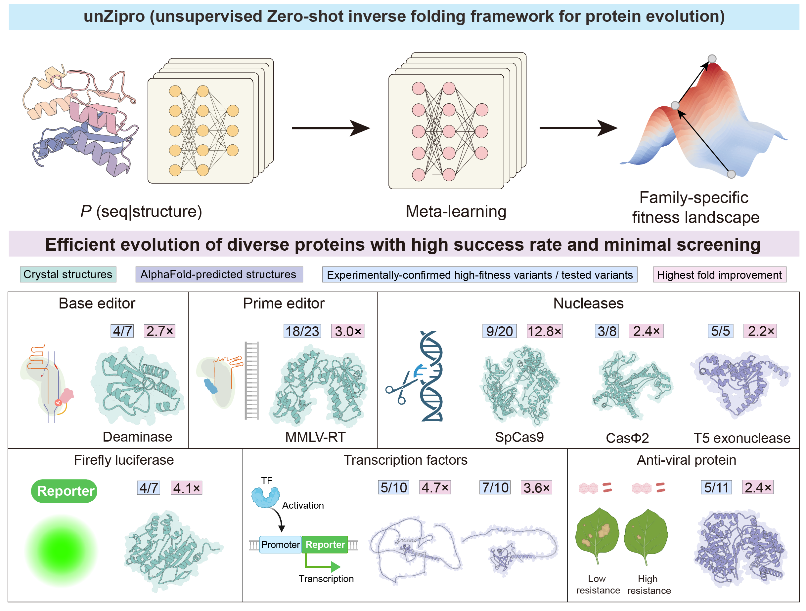
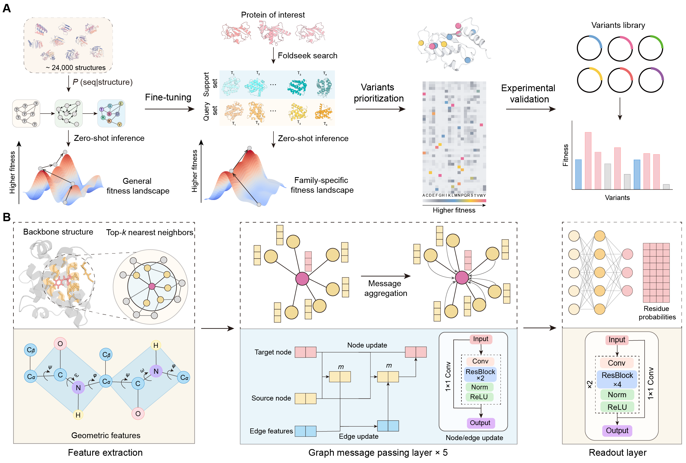
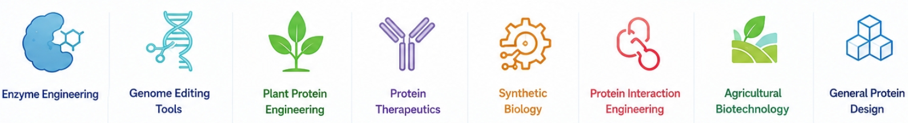

# unZipro  [](https://colab.research.google.com/github/Gabriel-QIN/unZipro/blob/master/notebooks/unZipro.ipynb)  [](https://ai4bio.online/unZipro/home)  [](https://github.com/Gabriel-Qin/unZipro)  [](https://www.python.org/)  [](https://opensource.org/licenses/Apache-2.0)  


> Official PyTorch implementation of **unZipro** — an unsupervised zero-shot inverse folding framework for protein evolution and high-fitness variant prediction.

---




# Overview

unZipro (unsupervised Zero-shot inverse folding framework for protein evolution) is a lightweight graph neural network (GNN)-based framework designed for AI-guided protein engineering.

By combining general inverse folding constraints with family-specific adaptation, unZipro can efficiently prioritizes high-fitness mutations without exhaustive screening.




## ⚙️ How it works
unZipro tackles protein engineering like “hunting for the needle in the haystack”:

- 🧠 Zero-shot transfer learning captures a universal protein fitness landscape.
- 🧩 Meta-learning adapts to family-specific fitness landscapes.
- Prioritization of the most promising high-fitness variants for experimental validation.

## 🚀 Key Features of unZipro

1. Zero-shot transfer – predict functional variants without extensive few-shot training or large experimental datasets.
2. Highly efficient – drastically reduces experimental screening (as few as ~10 variants) and computational costs.
3. High accuracy – achieves an average of 61% success for high-fitness mutations (>1.1× WT), with up to 100% success and 28× improvement in desired properties.
4. Broad applicability – experimentally validated across enzyme, nucleases, polymerases, transcription factors, virus-resistance proteins, with potential for more protein engineering applications.
5. Structure-flexible: supports both experimentally-resoveled structures and AlphaFold-predicted models.


## Applications

unZipro is a general-purpose framework for in silico protein evolution and can be applied to a broad range of protein engineering tasks, including:

- **Enzyme engineering** – activity, stability, specificity, and rate-limiting enzymes.
- **Genome editing tools** – CRISPR-Cas systems, base editors, and prime editors.
- **Plant protein engineering** – disease resistance, transcription factors, and metabolic enzymes.
- **Protein therapeutics** – antibodies, therapeutic enzymes, cytokines, and peptides.
- **Synthetic biology** – metabolic pathways, biosensors, and regulatory proteins.
- **Protein interaction engineering** – protein–ligand and protein–nucleic acid interactions.
- **Agricultural biotechnology** – crop improvement and stress tolerance.
- **General protein design** – beneficial mutation discovery for diverse proteins.


# Google Colab  [](https://colab.research.google.com/github/Gabriel-QIN/unZipro/blob/master/notebooks/unZipro.ipynb)
We provide a convenient [Google Colab notebook](https://colab.research.google.com/github/Gabriel-QIN/unZipro/blob/master/notebooks/unZipro.ipynb) to run unZipro on-the-fly without any local installation.
>For optimal performance when running unZipro, we strongly recommend using a GPU with > 32 GB of memory. This ensures sufficient memory to handle complex computations and avoid memory errors.


# Run unZipro on local machine
## Installation
### Anaconda
Please first install [Anaconda](https://www.anaconda.com/download) or [Miniconda](https://docs.conda.io/en/latest/miniconda.html).
Then create and activate a conda enviroment as follows:
```sh
git clone https://github.com/Gabriel-Qin/unZipro.git
cd unZipro

# Install dependencies and PyTorch automatically
bash runs/install_unZipro.sh
```
Alternatively, you can manually install all dependencies with:
```sh
pip install -r requirements.txt
```
unZipro requires Python >= 3.9 and is compatible with PyTorch versions later than 2.0. Users should install the appropriate [PyTorch](https://pytorch.org/get-started/locally/) and [CUDA](https://developer.nvidia.com/cuda-downloads) versions according to your local hardware and driver environment.
Example installation for PyTorch with CUDA 12.4:
```sh
pip install torch==2.4.1+cu124 --index-url https://download.pytorch.org/whl/cu124
```
After installation, verify the environment with:
```sh
python -c "import torch; print(torch.__version__, torch.cuda.is_available())" # Expected output: `2.4.1+cu124 True`
```
This confirms that PyTorch is correctly installed and GPU acceleration is available.

### Docker
A Docker image is provided to ensure a reproducible runtime environment without manually configuring dependencies.
Please configure your Docker environment according to the official documentation for [Docker](https://docs.docker.com/get-docker/) and [NVIDIA Container Toolkit](https://docs.nvidia.com/datacenter/cloud-native/container-toolkit/latest/install-guide.html)
#### Pull image
```sh
docker pull crpi-d49mzvu99jzxukne.cn-hongkong.personal.cr.aliyuncs.com/gabrielqin/unzipro:latest
docker tag crpi-d49mzvu99jzxukne.cn-hongkong.personal.cr.aliyuncs.com/gabrielqin/unzipro:latest unzipro:latest
```

#### Test GPU availability
```sh
docker run --rm --gpus all \
    unzipro:latest \
    python -c "import torch; print(torch.cuda.is_available())" # Expected output is True
```

#### Start container
```sh
docker run --rm --gpus all -it \
    -v $(pwd):/workspace/unZipro \
    -w /workspace/unZipro \
    unzipro:latest \
    bash
```

## High-fitness mutation prioritization

> unZipro predicts and prioritizes beneficial mutations directly from protein structures, enabling structure-aware protein engineering without supervised fine-tuning.

### Inference:
#### Local environment
```sh
python script/main.py --pdb 6vpcE --pdb_dir data/example/ --outdir data/outputs/ --work_dir data/tmp --pretrained --rank_by_prob --logits --probs
```
#### Docker
```sh
docker tag crpi-d49mzvu99jzxukne.cn-hongkong.personal.cr.aliyuncs.com/gabrielqin/unzipro:latest unzipro:latest
docker run --rm --gpus all -it unzipro:latest \
python script/main.py \
    --pdb 6vpcE \
    --pdb_dir data/example/ \
    --outdir data/outputs/ \
    --work_dir data/tmp \
    --pretrained \
    --rank_by_prob \
    --logits \
    --probs
```
Input flags:

- `--pdb`
   PDB name(s) for inference. Supports comma-separated PDB IDs or a text file containing multiple IDs.
- `--pdb_dir`
   Directory containing input PDB structure files.
- `--outdir`
   Directory for saving prediction outputs.
- `--work_dir`
   Temporary working directory for intermediate files.
- `--pretrained`
   Use the pretrained inverse folding model directly for mutation prioritization without fine-tuning.
- `--rank_by_prob`
   Rank candidate mutations according to predicted mutation probabilities.

Additional optional flags:

- `--gpu` / `--cpu_only`
   Specify GPU device ID or force CPU-only inference.
- `--probs` / `--logits`
   Output per-residue mutation probabilities or raw logits.
- `--res`
   Restrict prediction outputs to specific residues (e.g., `83,123`).
- `--epochs`, `--adapt_lr`, `--meta_lr`, `--adapt_step`
   Hyperparameters for meta-transfer fine-tuning.
- `--batchsize`, `--patience`, `--noise`
   Training batch size, early stopping patience, and training noise level.
- `--nneighbor`
   Number of neighboring residues used in graph construction.
- `--skip_foldseek`
   Skip Foldseek search if precomputed results are already available.
- `--save_model_ckp`
   Save model checkpoints during training.

The outputs include:

- Per-residue mutation probabilities/logits at `data/outputs/{your_protein_name}.info_probs.csv` and `data/outputs/{your_protein_name}.info_logits.csv!`

- Ranked potential high-fitness mutations at `data/outputs/{your_protein_name}.info_rank_by_prob.csv`

Following are some provided `examples`:

| Category               | Script                                                                                                      | Description                                             |
| ---------------------- | ----------------------------------------------------------------------------------------------------------- | ------------------------------------------------------- |
| **Genome editors**     | [`runs/run_ABE.sh`](runs/run_ABE.sh)                                                                        | Adenine base editor (TadA8e)                            |
|                        | [`runs/run_nuclease.sh`](runs/run_nuclease.sh)                                                              | Three nucleases (SpCas9, CasΦ2/Cas12j2, T5E)            |
|                        | [`runs/run_polymerase.sh`](runs/run_polymerase.sh)                                                          | MMLV reverse transcriptase under multiple conformations |
| **Fluorescent enzyme** | [`runs/run_luciferase.sh`](runs/run_luciferase.sh)                                                          | Luciferase for improved fluorescence intensity          |
| **Plant proteins**     | [`runs/run_plantTF.sh`](runs/run_plantTF.sh)                                                                | DNA-binding domains of plant transcription factors      |
|                        | [`runs/run_R_protein.sh`](runs/run_R_protein.sh)                                                            | Plant virus-resistance (R) proteins                     |

## Pretraining
You can reproce the unZipro pre-training and evaluation following the instructions from [Pre-training](docs/pretrain.md).

### Pretrain on PDB50 datasets
#### 1. Download full PDB50 dataset
```python
python script/fetch_PDB_parallel.py -i data/pretrained/all_PDB50.txt -o data/pretrained/PDB -m RCSB -cpu 8
```
#### 2. Start pre-training
```python
python script/unZipro_pretrain.py \
    --train_list data/pretrained/train.txt \
    --valid_list data/pretrained/valid.txt \
    --pdbdir data/pretrained/PDB \
    --epochs 100 \
    --batchsize 10 \
    --model Models \
    --cachedir data/pretrained/tmp/ \
    --project_name unZipro_pretrain
```
#### 3. Evaluate the pre-trained model
You can evaluate the pre-trained unZipro model on a single benchmark dataset, for example TS50, by running:
``` 
dataset=TS50
python script/unZipro_evaluate.py --project_name unZipro_${dataset}_test \
    --input data/pretrained/benchmark/${dataset}.txt \
    --pdbdir data/pretrained/benchmark/${dataset} \
    --outdir outputs/seq_design \
    --config_path config/unZipro_pretrain.json \
    --param Models/unZipro_params.pt \
    --gpu 0 \
    --sampling_strategy argmax
```
#### 4. Batch evaluation on multiple benchmarks
To conveniently evaluate the model across multiple benchmark datasets (e.g., PDB50), you can run the provided shell script:
```sh
bash runs/evaluate_pretrained_model.sh
```

Or pre-train on your own structure dataset
```python
python script/unZipro_pretrain.py \
    --train_list data/pretrained/train.txt \
    --valid_list data/pretrained/valid.txt \
    --pdbdir data/pretrained/PDB \
    --epochs 100 \
    --batchsize 10 \
    --model Models \
    --cachedir data/pretrained/tmp/ \
    --project_name unZipro_pretrain
```

## Finetuning
Run unZipro fine-tuning easily with the following command.  
```
# Before runnning, you must prepare your train/valid dataset (each file with corresponding PDB IDs)
# Or you can use the Foldseek-retrieved structures as your fine-tuninng datasets.
# Please ensure your PDB files are in `pdbdir`
name=ABE
python script/unZipro_finetuning.py --train data/finetuned_dataset/${name}/train.csv --valid data/finetuned_dataset/${name}/test.csv --project_name unZipro_${name} --model Models/finetuned/${name} --pdbdir data/finetuned_dataset/PDB/ --cache_dir data/finetuned_dataset/tmp/ --epoch 20 
```
For more details, see [Finetuning](docs/finetuning.md).

## Acknowledgements
We gratefully acknowledge the open-source community for providing valuable tools and insights that inspired the development of unZipro.
This work builds upon ideas and methodologies introduced by previous research in AI/ML, protein design, and AIxbio community.

In particular, we recognize the contributions of prior works including many graph-based protein design frameworks and Foldseek, which have laid the foundation for advances in structure-informed protein engineering.

We sincerely thank the authors of these repositories for their pioneering efforts and their invaluable contributions to the broader scientific community.


## Citation

If you use **unZipro** in your research, please cite:

> Qin, Z., Zhao, S., Deng, Z., Si, X., Cheng, X., Zhang, Z., Zhang, Y., Han, X., Zhang, J., Chen, Y., Liu, X., Li, J., Fu, L., You, L., Murray, J. W., Liu, H., Li, H., Li, C., Wu, S., Li, J., Chen, Z., Song, J., Wang, D., & Ji, X. 
Simplifying in silico protein evolution with minimal screening by unZipro. Manuscript under review.


## License
Distributed under [Apache 2.0](https://github.com/Gabriel-QIN/unZipro/blob/master/LICENSE) license.